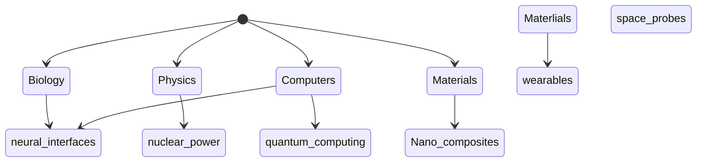

## Principles

- Technical innovation can be:
	- Incremental if no new scientific principle 
	- Breakthrough if new scientific laws are essential

- Miracles:
	- Antimatter production -- Mostly a scaling issue but also containment
	- Gravetics -- fundamental new laws
	- Super-efficient reaction drive -- Waveing thermodynamics
	- Reactionless thruster -- Fundamental new laws
	- Nantotechnology?
	- FTL warp drive
## How to model
 - Tech tree?

Innovations have phases which let them contribute as  prerequisites to other innovations

Capabilities with innovator name?  Excludes non-humans -- but humans will stay provincial
	