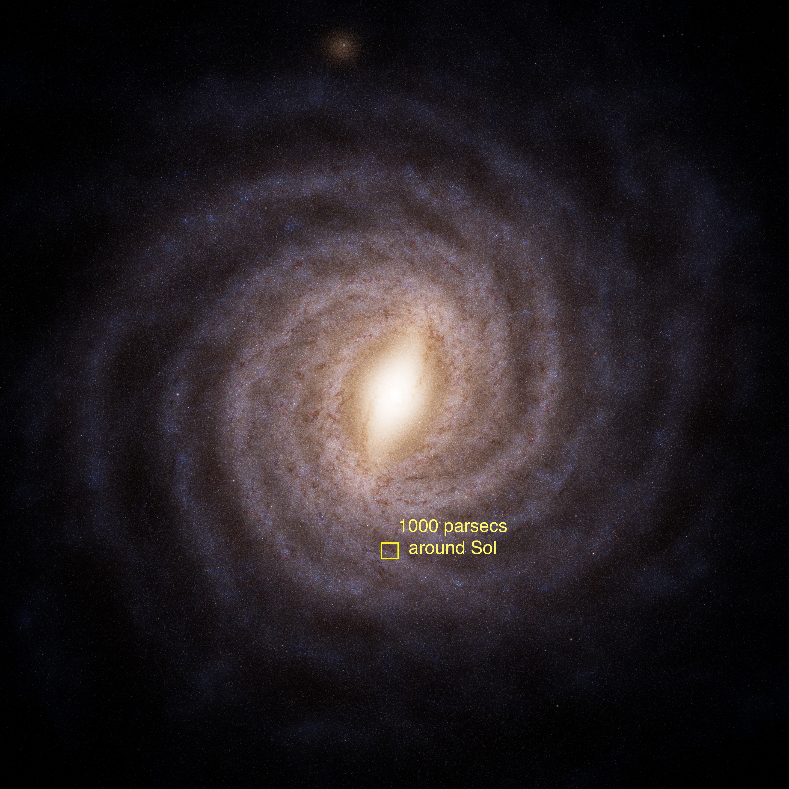

# Mapping the Milky Way for Science Fiction

"Space is big. You just won't believe how vastly, hugely, mind-bogglingly big it is. I mean, you may think it's a long way down the road to the chemist's, but that's just peanuts to space." 
... Douglas Adams, Hitchhikers Guide to the Galaxy

## Reality and science fiction

I love Asimov's **Foundation**.  I am also reasonably fond of the Star Wars **Galactic Empire**, and for a wild place for a wargame it's harder to get ahead of Warhammer 40K's **Imperium of Man**.

Once you take a good look at the scale of our galaxy (admittedly according to current thinking in the top 15% of galaxy by mass) the plausibility of any polity spanning the whole galaxy becomes small indeed.   But that's plausibility, not possibility.  You don't need to spend long with reactivity, the rocket equation, or thermodynamics to realize how *impossible* it all is.

But that makes interstellar empires a literary device.  The creator (be they an author, a game master, or simply a worldbuilder) can use an interstellar civilization to explore parts of the human experience which are important right now but are too close to home to look at objectively. Example?  For all that the Star Wars galaxy is a mass of handwaves linking "Planet Of Hats" tropes, the political relevance of **Andor** is entirely obvious.

## So what does that have to do with this project?

This project is a set of worldbuilding tools to help with the creation of an interstellar stage for adventure that reflects (although in a distorted mirror) some aspects key aspects of reality.

***ColonyModels*** is a tool for modelling the population, economy, and social stresses of a group of people -- in our case the inhabitants of a colony world.  It is based primarily  on the work of [Peter Turchin ](https://peterturchin.com/cliodynamics-history-as-science/) greatly simplified.  *Status: WIP*

***Meridian*** is a star map in three dimensions, extending out (currently) 450 parsecs from Earth.  It is based on the work of amateur astronomer [David Nash](https://www.astronexus.com/projects/at-hyg) in integrating the available astrometric data from a number of missions.  Unsurprisingly, the further or dimmer a star is the less likely it is to me successfully observed.  For that reason I have used stellar census data and the reasonable limits of observation to fill in stars that would be missed by observation.  In other words, much of the data is made up.  *Status: complete*

***WorldMaps*** is based on the work of [FreezeDriedMangos](https://github.com/FreezeDriedMangos/realistic-planet-generation-and-simulation) with a port to typescript and the addition of a server for data storage and annotation.  Because it is easier to imagine fiction for a planet when you can see it. *Status: WIP*

***Worlds*** is a tool to save, edit, and track structured information about the fictional universe.  It sits on a foundation of the data from Meridian and will provide tools to augment the generated immutable base.  It is likely that the other tools in this project will be folded into it.  *Status: Wip*

